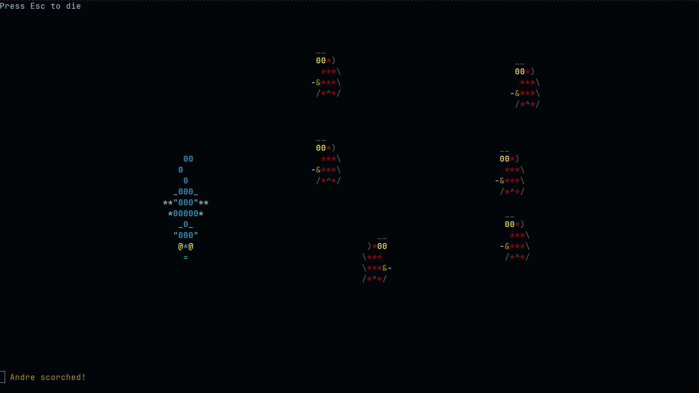

# Trash The Dragon

## About
The game is written in the old and almost forgotten Free Pascal with the use of
the *crt* module (which isn't much young and known too).\
The author of the idea and implementation is me, Ors1mer.

Gameplay is pretty straightforward, control keys are WSDA & Space,
also Esc and Enter.\
Go to the *info menu* right in the game to find out more.

The point of the game is to scorch all nine bishops, though it is easy to make
it impossible (*by default you have* ***no chances***).\
The difficulty can be changed by changing the *r* and 
*ressurectBi* constants in file *units/constants.pp*.
## Usage
**Install** in the system (*~/.config/bin* must be in *$PATH*) and launch:
```bash
make install && ttd
```
Or **compile** within repository:
```bash
make && ./ttd_dev
```
**Dependencies:**
 - *fpc* v3.2.2 or later
